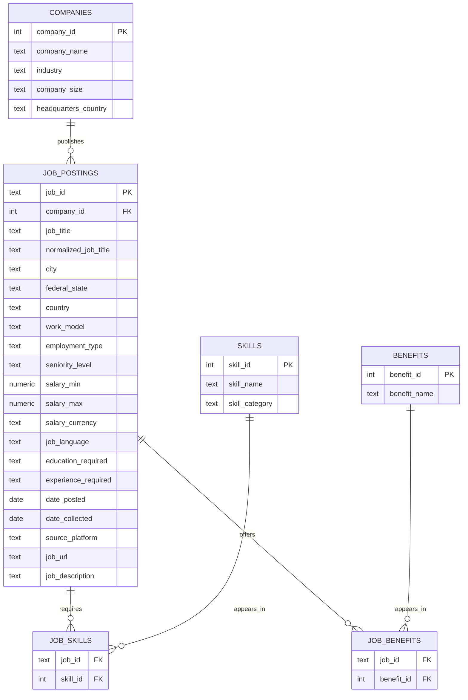

# Database Schema

## Overview

The database is designed to store job postings, companies, required skills and job benefits.

Each job posting belongs to one company and may contain multiple skills and benefits.

## Entity Relationship Diagram

## Table Purpose

### companies

Stores company-level information that may be reused across multiple job postings.

### job_postings

Stores the main details of each collected vacancy.

### skills

Stores the standardized list of technical and business skills.

Examples:

- SQL
- Python
- Power BI
- Tableau
- Excel
- SAP
- AWS
- Azure

### job_skills

Connects job postings with required skills.

One job posting may require multiple skills, and one skill may appear in many job postings.

### benefits

Stores standardized employee benefits.

Examples:

- Remote work
- Flexible working hours
- Training budget
- Company pension
- 30 vacation days

### job_benefits

Connects job postings with offered benefits.